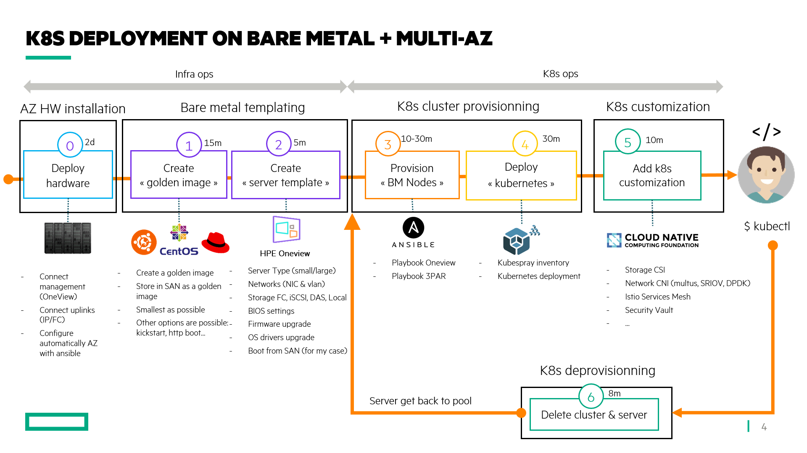
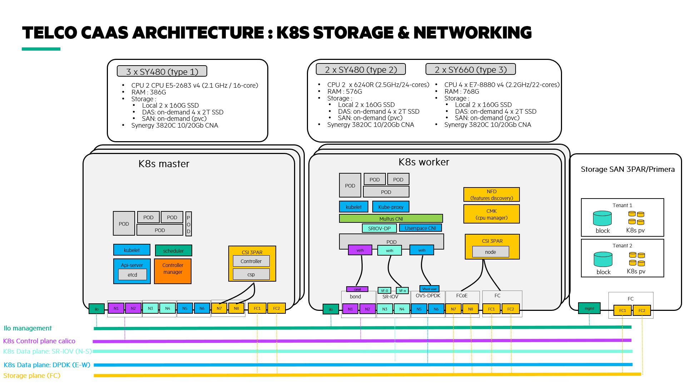

# 1/ Telco Container-as-a-Service on Baremetal
This tutorial walks through the set up of kubernetes on Bare Metal using the projects from the opensource and the CNCF.
but first, let's try to define what a  telco CaaS is:
- provide the features to run network functions (data plane acceleration SR-IOV/DPDK...)
- based on the industry standards (LinuxFoundation/CNCF, CNTT, ETSI, ONAP, opensource,..) and API driven
- provide tools to operate the CaaS and NFs (lifecycle management)
- provide tools to mesure the CaaS and NFs (telemetry, monitoring, alerting)
- provide tools to secure the CaaS and NFs (business continuity, runtime, vault, SIEM)
- provide tools to operate the NFs (Service Mesh, autoscaling ...)

> test this block is for quote






# 2/ Target audience
Anyone planning to support a Kubernetes in production. Could be system engineer, devops engineer, kubernetes operators.

# 3/ Prerequisites
For Bare metal, I'm using HPE Synergy Composable infrastructure with HPE OneView API and HPE 3PAR for strorage (block and persistent volume)
Further investigation with redfish is in progress.

# 4/ Quick Start
## 4.1/ Deprovisionning k8s cluster (kubespray and bare metal servers)
### 4.1.1/ Uninstall kubespray (5m)
```
conda activate python36
cd /home/tdovan/workspace/github/kubespray
ansible-playbook -i inventory/orange/inventory.ini reset.yml -b
```

### 4.1.2/ Deprovision Bare Metal Server (5m)
```
conda activate python36
cd /home/tdovan/workspace/github/ansible-synergy-3par
ansible-playbook -i inventory/synergy-inventory tasks/ov-poweroff-delete-serverprofile.yaml --limit az1,az2,az3
ansible-playbook -e "ansible_python_interpreter=/home/tdovan/anaconda3/envs/python36/bin/python" -i inventory/synergy-inventory tasks/infra-deregister-dns.yml --limit az1,az2,az3
```

### 4.1.3/ Clear OneView alarm (1m)
```
## Useful when using Synergy beta unit. It clears alarm of the server otherwise oneview will not allow to re-provision without clearing the faults
curl https://packages.microsoft.com/config/rhel/7/prod.repo |  sudo tee /etc/yum.repos.d/microsoft.repo
sudo yum makecache
sudo yum install powershell
pwsh
PS /root> Install-Module hponeview.500
PS /root> $az1=Connect-HPOVMgmt -Appliance az1.tdovan.co -UserName $username -Password $password
PS /root> $az2=Connect-HPOVMgmt -Appliance az1.tdovan.co -UserName $username -Password $password
PS /root> $az3=Connect-HPOVMgmt -Appliance az1.tdovan.co -UserName $username -Password $password

PS /root> Get-HPOVServer -ApplianceConnection $az1 | Get-HPOVAlert -State active | Set-HPOVAlert -Cleared
PS /root> Get-HPOVServer -ApplianceConnection $az2 | Get-HPOVAlert -State active | Set-HPOVAlert -Cleared
PS /root> Get-HPOVServer -ApplianceConnection $az3 | Get-HPOVAlert -State active | Set-HPOVAlert -Cleared
PS /root> Disconnect-HPOVMgmt -Appliance 

## for a dedicated server hardware
Get-HPOVServer -name "Encl1, bay 1*" -ApplianceConnection $az1 | Get-HPOVAlert -State active | Set-HPOVAlert -Cleared

```

## 4.2/ Provisionning k8s cluster on Bare Metal
### 4.2.1/ Provisionning Bare Metal servers with HPE OneView (30m)
```
conda activate python36
cd /home/tdovan/workspace/github/ansible-synergy-3par
ansible-playbook -e "ansible_python_interpreter=/home/tdovan/anaconda3/envs/python36/bin/python" -i inventory/synergy-inventory 1-deploy-bfs-az-all.yaml --limit az1,az2,az3 --forks 20
ansible-playbook -i inventory/synergy-inventory 2-configure-kubespray-nodes.yaml --limit az1,az2,az3
```
### 4.2.2/ Deploy k8s cluster with kubespray (30m)
```
cd /home/tdovan/workspace/github/kubespray
ansible-playbook -i inventory/orange/inventory.ini  --become --become-user=root cluster.yml --flush-cache
```

### 4.2.3/ Connecting to the cluster (1m)
```
ansible-playbook -i inventory/synergy-inventory 3-merge-kubeconfig.yaml --limit localhost
ktx kubernetes-admin@cluster.local
k get nodes
```

## 4.3/ Customize k8s
### 4.3.1/ Persistent storage with HPE 3PAR CSI (5m)
```
this is the helm v3 chart but the operator is also available
https://operatorhub.io/operator/hpe-csi-driver-operator
https://scod.hpedev.io/csi_driver/index.html
https://hub.helm.sh/charts/hpe-storage/hpe-csi-driver


helm repo add hpe https://hpe-storage.github.io/co-deployments
helm repo update
cd /home/tdovan/workspace/github/co-deployments/helm/values/csi-driver/v1.2.0
kns kube-system
helm install hpe-csi hpe-storage/hpe-csi-driver --namespace kube-system -f values-hpedemocenter.yaml
k get pods --selector 'app in (primera3par-csp,hpe-csi-node,hpe-csi-controller)'

k delete sc hpe-standard
k apply -f 3par-sc.yaml
k apply -f hpe-csi-pvc.yaml
ssh 3paradm@$ip
showvv *pvc*

helm repo add bitnami https://charts.bitnami.com/bitnami
helm repo update
helm search repo bitnami/wordpress
helm install my-wordpress bitnami/wordpress --version 9.2.1 --set service.type=ClusterIP,wordpressUsername=admin,wordpressPassword=adminpassword,mariadb.mariadbRootPassword=secretpassword,persistence.existingClaim=pvc-testtan-1,allowEmptyPassword=false

k delete pods --selector 'app in (primera3par-csp,hpe-csi-node,hpe-csi-controller)'
k get pods --selector 'app in (primera3par-csp,hpe-csi-node,hpe-csi-controller)'
k apply -f hpe-csi-pvc.yaml

helm uninstall hpe-csi --namespace kube-system
``` 

### 4.3.2/ LoadBalancer as a Service with Metallb (3m)
```
cd /home/tdovan/workspace/k8s-apps/metallb
k apply -f namespace.yaml
./metallb-createsecret.sh
k apply -f metallb.yaml
k apply -f configmap-130-139.yaml
k get svc
k kubectl patch svc kubernetes-dashboard -p '{"spec": {"type": "LoadBalancer"}}'
k get svc
k create serviceaccount dashboard-admin-sa
k create clusterrolebinding dashboard-admin-sa --clusterrole=cluster-admin --serviceaccount=default:dashboard-admin-sa
kubectl describe secret kubernetes-dashboard-token-zcklt

Access k8s dashboard https://10.12.25.130 (with chrome, type: 'thisisunsafe' to skip ssl)

--> TODO: ok when NOT using RBAC
```

### 4.3.3/ Multi-homed pod with multus-cni (3 minutes)
```
https://github.com/intel/multus-cni/blob/master/doc/how-to-use.md

cd /home/tdovan/workspace/github/ansible-synergy-3par
ansible-playbook -i inventory/synergy-inventory 3-configure-multus.yml --limit az1,az2,az3

cd /home/tdovan/workspace/k8s-apps/multus-cni
cat ./images/multus-daemonset.yml | kubectl apply -f -
k get pods --selector 'app in (multus)'

k apply -f hpe_networkattachment-macvlan-conf-1.yaml 
k apply -f hpe_networkattachment-macvlan-conf-2.yaml 

k apply -f hpe_pod-multus-1macvlan.yaml
k exec -it pod-multus-1 -- ip a

k apply -f hpe_pod-multus-2macvlan.yaml
k exec -it pod-multus-2 -- ip a
```

### 4.3.4/ Service Mesh with Istio (10m)
```
cd /home/tdovan/workspace/k8s-apps/istio/
kubectl create namespace istio-system
istioctl manifest apply --set profile=demo
kns istio-system
kubectl patch svc kiali -p '{"spec": {"type": "LoadBalancer"}}'
go to kiali dashbaord: http://10.12.25.132:20001 (admin/admin)

kns default
k label namespace default istio-injection=enabled
cd /home/tdovan/workspace/k8s-apps/istio/istio-1.5.1
k apply -f samples/bookinfo/platform/kube/bookinfo.yaml
k exec -it $(kubectl get pod -l app=ratings -o jsonpath='{.items[0].metadata.name}') -c ratings -- curl productpage:9080/productpage | grep -o "<title>.*</title>"
k apply -f samples/bookinfo/networking/bookinfo-gateway.yaml
kubectl get svc istio-ingressgateway -n istio-system

export INGRESS_HOST=$(kubectl -n istio-system get service istio-ingressgateway -o jsonpath='{.status.loadBalancer.ingress[0].ip}')
export INGRESS_PORT=$(kubectl -n istio-system get service istio-ingressgateway -o jsonpath='{.spec.ports[?(@.name=="http2")].port}')
export SECURE_INGRESS_PORT=$(kubectl -n istio-system get service istio-ingressgateway -o jsonpath='{.spec.ports[?(@.name=="https")].port}')
export GATEWAY_URL=$INGRESS_HOST:$INGRESS_PORT
echo $GATEWAY_URL

http://10.12.25.131:80/productpage (refresh page to round robin through services)
go to kiali dashbaord: http://10.12.25.132:20001 (admin/admin)
```

### 4.3.5/ Implementing SR-IOV for Synergy CNA3820
```
## In Synergy Server Profile Template, enale virtual function (auto) at the Server Profile (Template) for Connections
yum install pciutils

## check if SR-IOV is enable
ethtool -i ens3f0
lspci -vvv -s 0000:0c:00.0
c:00.0 Ethernet controller: Broadcom Inc. and subsidiaries BCM57840 NetXtreme II Ethernet Multi Function (rev 11)
        Subsystem: Hewlett-Packard Company 3820C 10/20Gb Converged Network Adapter (NPAR 1.5)
        Physical Slot: 3
<snip>
        Capabilities: [1c0 v1] Single Root I/O Virtualization (SR-IOV)
                IOVCap: Migration-, Interrupt Message Number: 000
                IOVCtl: Enable- Migration- Interrupt- MSE- ARIHierarchy+
                IOVSta: Migration-
                Initial VFs: 64, Total VFs: 64, Number of VFs: 0, Function Dependency Link: 00
                VF offset: 8, stride: 1, Device ID: 16ad
                Supported Page Size: 000005ff, System Page Size: 00000001
                Region 0: Memory at 0000039fffc00000 (64-bit, prefetchable)
                Region 4: Memory at 0000039fffe80000 (64-bit, prefetchable)
                VF Migration: offset: 00000000, BIR: 0
        Capabilities: [220 v1] #15
        Capabilities: [300 v1] #19
        Kernel driver in use: bnx2x
        Kernel modules: bnx2x
</snip>

## check the number of active SR-IOV VF
lspci | grep Broadcom
0c:00.0 Ethernet controller: Broadcom Inc. and subsidiaries BCM57840 NetXtreme II Ethernet Multi Function (rev 11)
0c:00.1 Ethernet controller: Broadcom Inc. and subsidiaries BCM57840 NetXtreme II Ethernet Multi Function (rev 11)

## check the max nb of VF supported:
cat  /sys/class/net/ens3f0/device/sriov_totalvfs

## Change the number of VFs reset the number to 0 :
for ens3f0
echo 0 > /sys/class/net/ens3f0/device/sriov_numvfs
echo 4 > /sys/class/net/ens3f0/device/sriov_numvfs

for ens3f1
echo 0 > /sys/class/net/ens3f1/device/sriov_numvfs
echo 4 > /sys/class/net/ens3f1/device/sriov_numvfs

## check the VF created
lspci | grep Broadcom
0c:00.0 Ethernet controller: Broadcom Inc. and subsidiaries BCM57840 NetXtreme II Ethernet Multi Function (rev 11)
0c:00.1 Ethernet controller: Broadcom Inc. and subsidiaries BCM57840 NetXtreme II Ethernet Multi Function (rev 11)
0c:01.0 Ethernet controller: Broadcom Inc. and subsidiaries NetXtreme II BCM57840 10/20 Gigabit Ethernet Virtual Function --> VF1 on ens3f0
0c:01.1 Ethernet controller: Broadcom Inc. and subsidiaries NetXtreme II BCM57840 10/20 Gigabit Ethernet Virtual Function --> VF2 on ens3f0
0c:01.2 Ethernet controller: Broadcom Inc. and subsidiaries NetXtreme II BCM57840 10/20 Gigabit Ethernet Virtual Function --> VF3 on ens3f0
0c:01.3 Ethernet controller: Broadcom Inc. and subsidiaries NetXtreme II BCM57840 10/20 Gigabit Ethernet Virtual Function --> VF4 on ens3f0
0c:09.0 Ethernet controller: Broadcom Inc. and subsidiaries NetXtreme II BCM57840 10/20 Gigabit Ethernet Virtual Function --> VF1 on ens3f1
0c:09.1 Ethernet controller: Broadcom Inc. and subsidiaries NetXtreme II BCM57840 10/20 Gigabit Ethernet Virtual Function --> VF2 on ens3f1
0c:09.2 Ethernet controller: Broadcom Inc. and subsidiaries NetXtreme II BCM57840 10/20 Gigabit Ethernet Virtual Function --> VF3 on ens3f1
0c:09.3 Ethernet controller: Broadcom Inc. and subsidiaries NetXtreme II BCM57840 10/20 Gigabit Ethernet Virtual Function --> VF4 on ens3f1

## congrats! You now have 4 VF per interfaces !

## check the VF
ip link show ens3f0
2: ens3f0: <BROADCAST,MULTICAST,UP,LOWER_UP> mtu 1500 qdisc mq state UP mode DEFAULT group default qlen 1000
    link/ether 62:91:90:b0:02:e5 brd ff:ff:ff:ff:ff:ff
    vf 0 MAC 00:00:00:00:00:00, tx rate 10000 (Mbps), max_tx_rate 10000Mbps, spoof checking on, link-state auto
    vf 1 MAC 00:00:00:00:00:00, tx rate 10000 (Mbps), max_tx_rate 10000Mbps, spoof checking on, link-state auto
    vf 2 MAC 00:00:00:00:00:00, tx rate 10000 (Mbps), max_tx_rate 10000Mbps, spoof checking on, link-state auto
    vf 3 MAC 00:00:00:00:00:00, tx rate 10000 (Mbps), max_tx_rate 10000Mbps, spoof checking on, link-state auto

## Configure the VF
note the value: spoof checking on --> The SR-IOV MAC address anti-spoofing (a.k.a MAC spoofcheck) feature protects from malicious VM MAC address spoofing. This feature can be voluntary enable or disable 
to enable|disable : ip link set ens3f0 vf 3 spoofchk on|off
or echo "ON" > /sys/class/net/ens3f0/device/sriov/0/spoofcheck


--- sources
https://github.com/intel/sriov-cni
https://github.com/hustcat/sriov-cni
https://github.com/intel/userspace-cni-network-plugin
https://github.com/intel/container-experience-kits-demo-area/blob/master/docs/nfv-features-in-k8s/README.md#baremetal-container-model

```

### 4.3.6/ Monitoring with sysidg
$ kubectl config use-context hcp-cluster-1
$ git clone https://github.com/draios/sysdig-cloud-scripts.git
$ cd /home/tdovan/workspace/k8s-apps/sysdig-cloud-scripts/agent_deploy/kubernetes/
$ kubectl create ns sysdig-agent
$ kubectl create secret generic sysdig-agent --from-literal=access-key=ba02b324-98b8-478f-b6a4-3645f82fa0c7 -n sysdig-agent
$ kubectl apply -f sysdig-agent-clusterrole.yaml -n sysdig-agent
$ kubectl create serviceaccount sysdig-agent -n sysdig-agent
$ kubectl create clusterrolebinding sysdig-agent --clusterrole=sysdig-agent --serviceaccount=sysdig-agent:sysdig-agent
$ kubectl apply -f sysdig-agent-configmap.yaml -n sysdig-agent
$ kubectl apply -f sysdig-agent-daemonset-v2.yaml -n sysdig-agent
go to https://app.sysdigcloud.com/


### ZZ/ Concourse-ci
fly -t tutorial login -c http://concourse-pks1.tdovan.co/ -u test -p test

### ZZ/ Connecting k8s cluster to core network L2/L3 (TODO)
```
TODO
calico bgp
vyos
```

### ZZ/ NFD and CMK (TODO)
```
TODO
NFD: https://github.com/kubernetes-sigs/node-feature-discovery
CMK: https://github.com/intel/CPU-Manager-for-Kubernetes

Network : multus macvlan (ens3f1) + Calico (ens3f0)
> activate interface ens3f1
> install multus
> enable macvlan on ens3f1
> start pod
> install trex

```

### 4.3.7/ Ingress traefik (TODO)
```
TODO
```

### 4.3.8/ Backup: Velero + Crunchy (TODO)
```
TODO
```

### 4.3.8/ Federation: KubeFedv2 (TODO)
```
TODO
```


# Detailed Step-by-Step
I have break down each steps:
* [00-deploy-hardware](00-deploy-hardware/README.md)
* [01-create-golden-image](01-create-golden-image/README.md)
* [02-create-oneview-server-template](02-create-oneview-server-template/README.md)
* [03-provision-bare-metal-server](03-provision-bare-metal-server/README.md)
* [04-deploy-kubespray](04-deploy-kubespray/README.md)
* [05-customize-kubernetes](05-customize-kubernetes/README.md)


